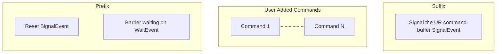
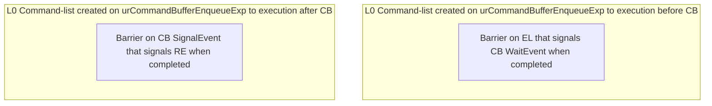

# Command-Graph Extension

This document describes the implementation design of the
[SYCL Graph Extension](https://github.com/intel/llvm/pull/5626).

A related presentation can be found
[here](https://www.youtube.com/watch?v=aOTAmyr04rM).

## Requirements

An efficient implementation of a lazy command-graph execution and its replay
requires extensions to the Unified Runtime (UR) layer. Such an extension is
command-buffers, where a command-buffer object represents a series of operations
to be enqueued to the backend device and their dependencies. A single
command-graph can be partitioned into more than one command-buffer by the runtime.
We distinguish between backends that support command-buffer extensions and
those that do not. Currently command-buffer extensions are only supported by
Level Zero. All other backends would fall back to an emulation mode, or not
be reported as supported.

The emulation mode targets support of functionality only, without potentially
resulting performance improvements, i.e. execution of a closed Level Zero
command-list multiple times.

### UR Command-Buffer Experimental Feature

The command-buffer concept has been introduced to UR as an
[experimental feature](https://oneapi-src.github.io/unified-runtime/core/api.html#command-buffer-experimental)
with the following entry-points:

| Function                                | Description |
| --------------------------------------- | ----------- |
| `urCommandBufferCreateExp`              | Create a command-buffer. |
| `urCommandBufferRetainExp`              | Incrementing reference count of command-buffer. |
| `urCommandBufferReleaseExp`             | Decrementing reference count of command-buffer. |
| `urCommandBufferFinalizeExp`            | No more commands can be appended, makes command-buffer ready to enqueue on a command-queue. |
| `urCommandBufferAppendKernelLaunchExp`  | Append a kernel execution command to command-buffer. |
| `urCommandBufferAppendMemcpyUSMExp`     | Append a USM memcpy command to the command-buffer. |
| `urCommandBufferAppendMembufferCopyExp` | Append a mem buffer copy command to the command-buffer. |
| `urCommandBufferEnqueueExp`             | Submit command-buffer to a command-queue for execution. |

See the [UR EXP-COMMAND-BUFFER](https://oneapi-src.github.io/unified-runtime/core/EXP-COMMAND-BUFFER.html)
specification for more details.

## Design

There are two sets of user facing interfaces that can be used to create a
command-graph object: Explicit and Record & Replay API. Within the runtime they
share a common infrastructure.

## Nodes & Edges

Nodes are represented by an internal `detail::node_impl` class which
stores a `sycl::detail::CG` object for the command-group that the node
represents. When a user adds a node to a graph using the explicit
`command_graph<modifiable>::add()` API passing a CGF, in the implementation a
`sycl::handler` object is created which finalizes the CGF, and after
finalization the CG object from the handler is moved to the node.

For creating a node in the graph using queue recording mode. When the
`sycl::handler` from a queue submission is finalized, if the queue the
handler was created from is in the recording mode, then the command-group from
finalization is added to the graph associated with the queue as a new node.

Edges are stored in each node as lists of predecessor and successor nodes.

## Sorting

The current way graph nodes are linearized into execution order is using a
reversed depth-first algorithm. Alternative algorithms, such as breadth-first,
are possible and may give better performance on certain workloads/hardware. We
are looking into giving the user control of this implementation detail.

## Scheduler Integration

When there are no requirements from accessors in a command-graph submission,
the scheduler is bypassed and the underlying UR command-buffer is directly
enqueued to a UR queue. If there are accessor requirements, the UR
command-buffer for the executable graph needs to be enqueued by the scheduler.

When individual graph nodes have requirements from SYCL accessors, the
underlying `sycl::detail::CG` object stored in the node is copied and passed to
the scheduler for adding to the UR command-buffer, otherwise the node can
be appended directly as a command in the UR command-buffer.

## Memory handling: Buffer and Accessor

There is no extra support for Graph-specific USM allocations in the current
proposal. Memory operations will be supported subsequently by the current
implementation starting with `memcpy`.

Buffers and accessors are supported in a command-graph. The following restrictions
are required to adapt buffers and their lifetime to a lazy work execution model:

- The lifetime of a buffer with host data will be extended by copying the underlying
data.
- Host accessors on buffers that are currently used by a command-graph are prohibited.
- Copy-back behavior on destruction of a buffer is prohibited.

## Backend Implementation

Implementation of [UR command-buffers](#UR-command-buffer-experimental-feature)
for each of the supported SYCL 2020 backends.

### Level Zero

The UR `urCommandBufferEnqueueExp` interface for submitting a command-buffer
takes a list of events to wait on, and returns an event representing the
completion of that specific submission of the command-buffer.

However, in the equivalent Level Zero function
[zeCommandQueueExecuteCommandLists](https://spec.oneapi.io/level-zero/latest/core/api.html#zecommandqueueexecutecommandlists)
there are no parameters to take a wait-list, and the only sync primitive
returned is blocking on host.

In order to get the UR command-buffer enqueue semantics we want with Level Zero,
the adapter implementation adds extra commands to the Level Zero command-list
representing a UR command-buffer.

* Prefix - Commands added to the start of the L0 command-list by L0 adapter.
* Suffix - Commands added to the end of the L0 command-list by L0 adapter.

These extra commands operate on L0 event synchronisation primitives, used by the
command-list to interact with the external UR wait-list and UR return event
required for the enqueue interface.

The `ur_exp_command_buffer_handle_t` class for this adapter contains a
*SignalEvent* which signals the completion of the command-list in the suffix,
and is reset in the prefix. This signal is detected by a new UR return event
created on UR command-buffer enqueue.

There is also a *WaitEvent* used by the `ur_exp_command_buffer_handle_t` class
in the prefix to wait on any dependencies passed in the enqueue wait-list.

For a call to `urCommandBufferEnqueueExp` with an `event_list` *EL*,
command-buffer *CB*, and return event *RE* our implementation has to create and
submit two new command-lists for the above approach to work. One before
the command-list with extra commands associated with *CB*, and the other
after *CB*.

